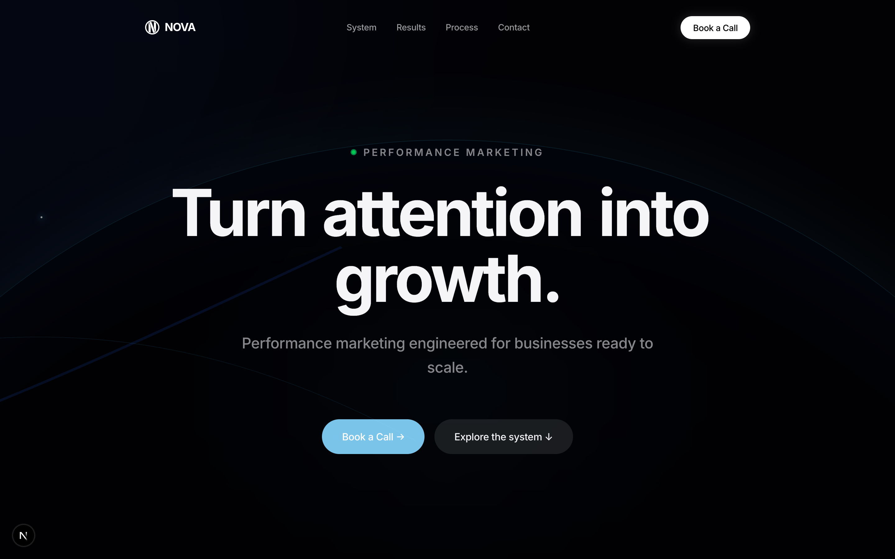
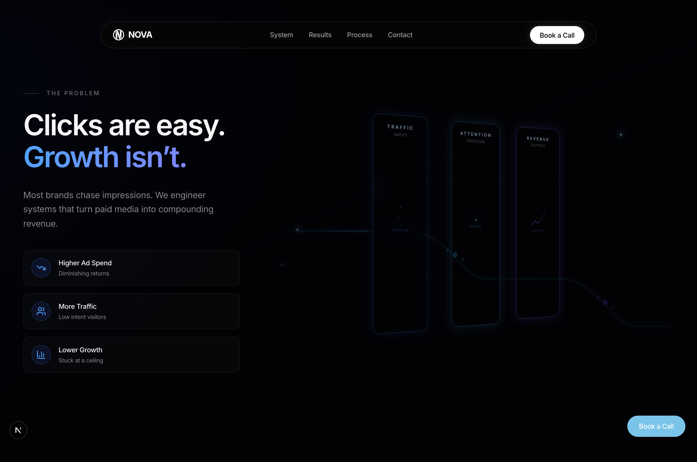
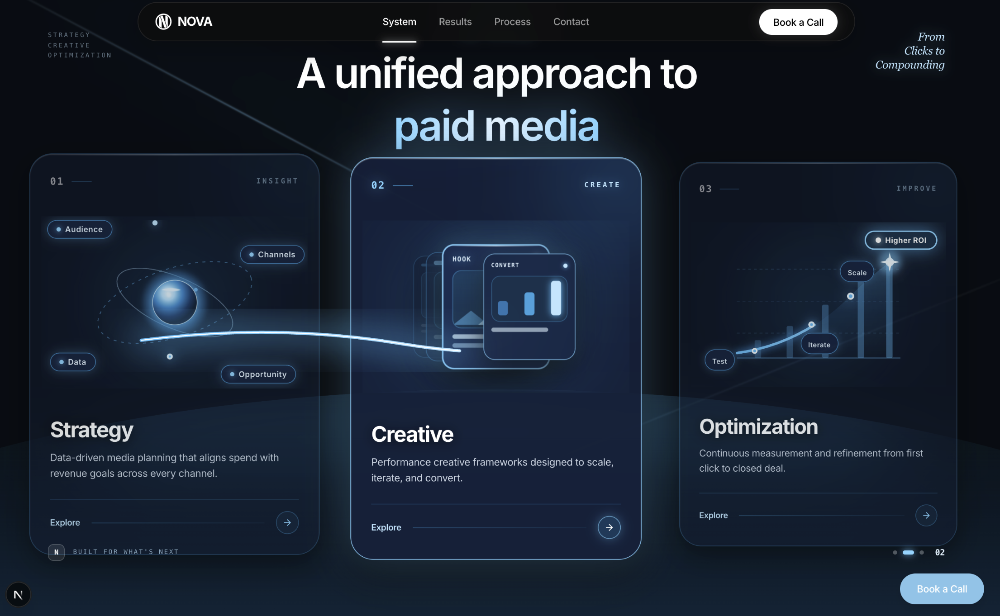
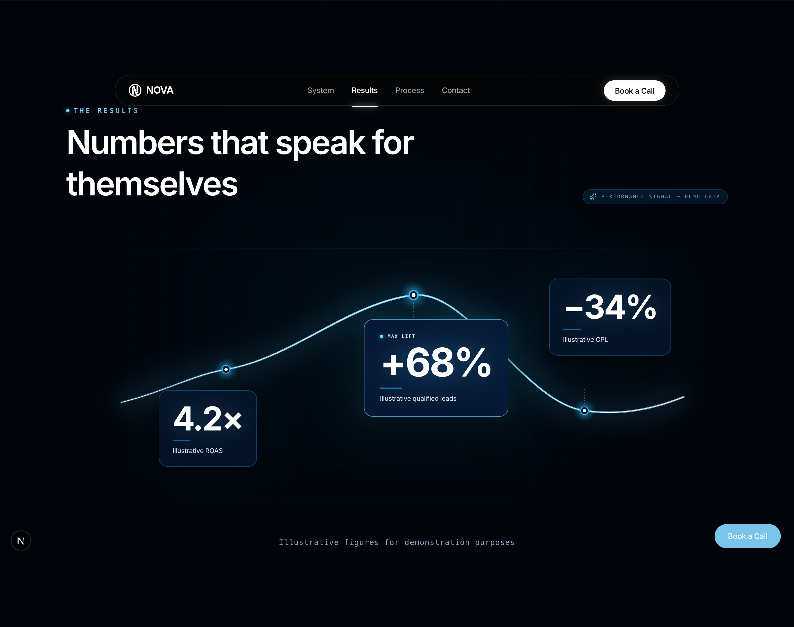
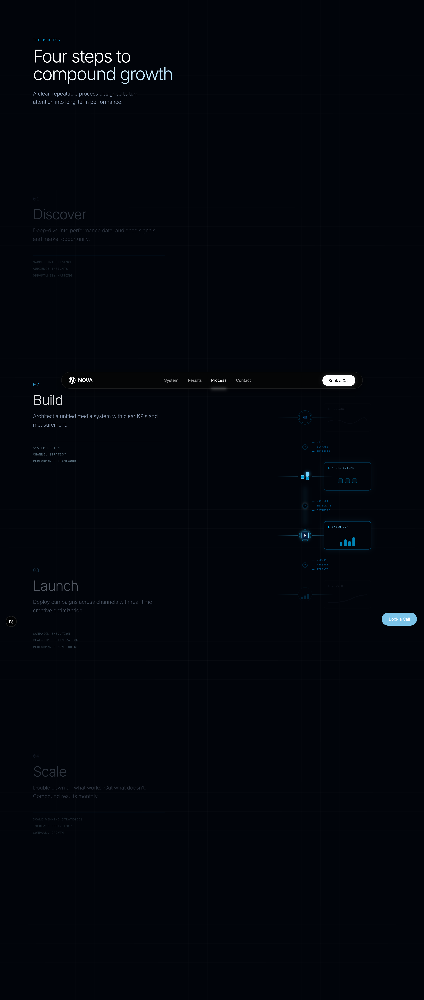
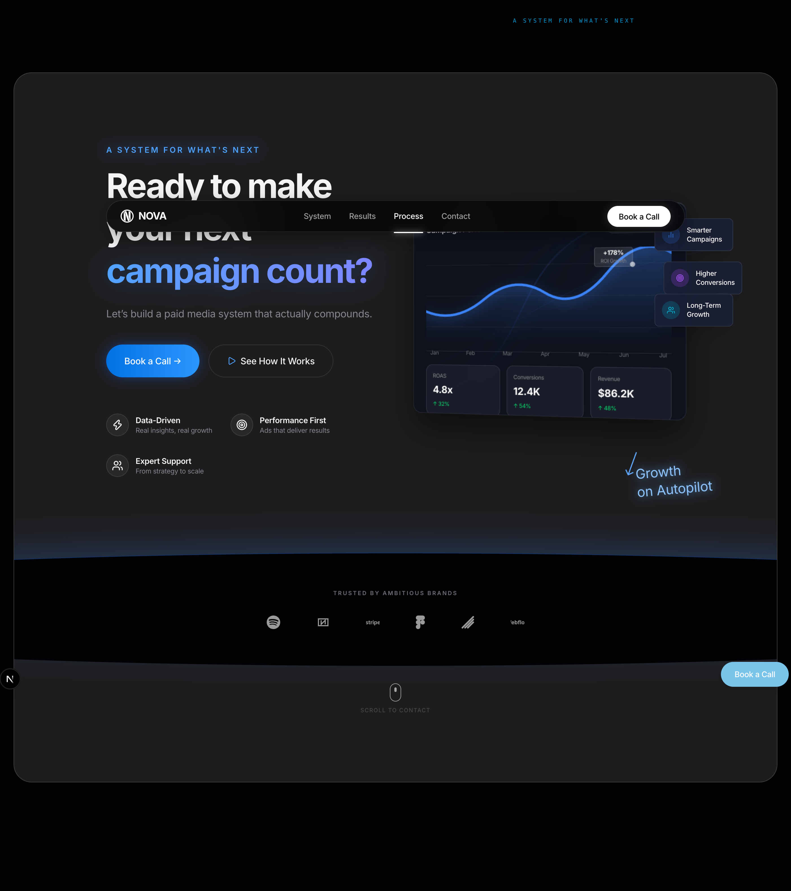
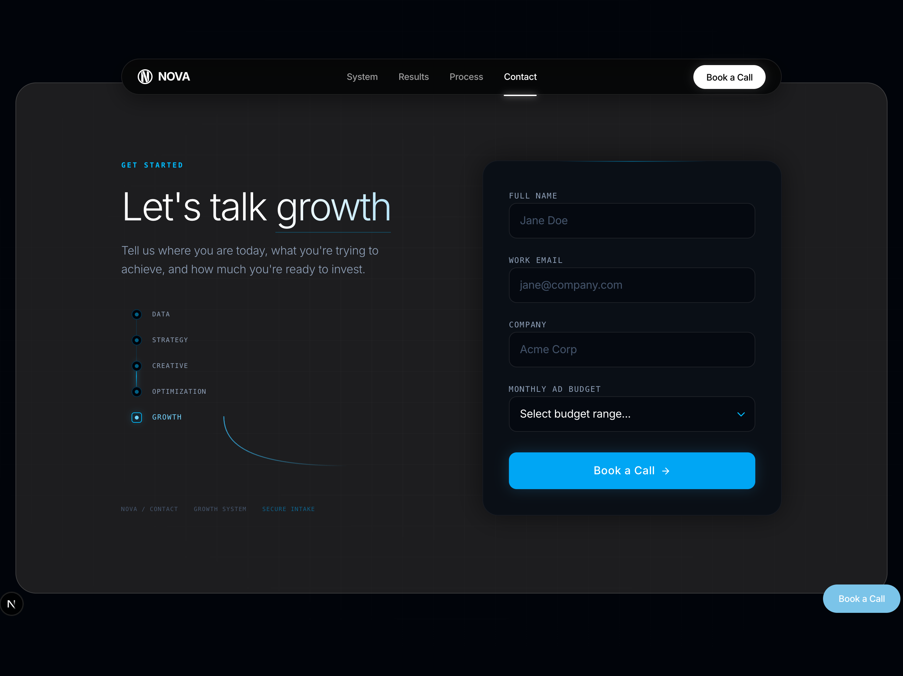
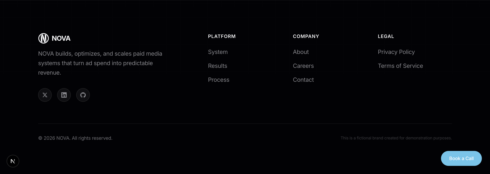

<div align="center">
  
  
  # NOVA — Performance Marketing Landing Page
  
  **A premium, high-conversion landing page engineered for modern performance marketing agencies.**
  
  [Live Demo](https://nova-landing-delta.vercel.app/) · [Report Bug](#) · [Request Feature](#)
</div>

<br />

## 🌟 Overview

NOVA is a cutting-edge landing page template designed specifically for modern performance marketing, media buying, and growth agencies. Built with **Next.js 15**, **React 19**, and **Tailwind CSS v4**, it leverages advanced scroll-linked animations via **Framer Motion** and custom 3D CSS transforms to create a premium "dashboard" aesthetic.

**Key Features:**
- 🌓 **Dark-First Premium UI:** Deep space aesthetic with vibrant blue/indigo glows and glassmorphism.
- 🚀 **Next.js 15 & Turbopack:** Lightning-fast static generation and optimized assets.
- 💫 **Scroll-Linked Animations:** Cinematic reveals, drawing SVG paths, and 3D tilting containers.
- 📱 **Fully Responsive:** Perfectly adapts from 4K desktop monitors down to mobile devices.
- 🎨 **Tailwind CSS v4:** Zero-config styling using the latest Tailwind inline theme engine.
- 📈 **Built for Conversion:** Features an integrated sticky scroll-spy navbar and a high-converting Lead Form.

---

## 📸 Modules Showcase

Every module is architected to guide the user seamlessly through the performance marketing journey.

### 1. The Hero
An immersive cinematic entrance featuring a breathing CSS gradient orb, live status indicators, and an instantly clear value proposition.


### 2. The Problem Statement
A split-screen module highlighting common pain points on the left, paired with a glowing SVG pipeline visualization on the right.


### 3. The Performance System
A horizontal-scroll (or grid) breakdown of the strategy, creative, and optimization unified approach.


### 4. Real Results
Clean, high-contrast metric cards that command attention and provide social proof.


### 5. The Process
A sticky, dual-column scroll experience guiding the user through the 4 core steps (Discover, Build, Launch, Scale) alongside a custom scalable SVG machine assembly visualization.


### 6. The Final CTA Dashboard
A stunning 3D isometric dashboard showcasing mock performance metrics, hovering glass badges, and glowing SVGs to drive the final call to action.


### 7. Lead Capture & Premium Footer
A conversion-optimized lead capture form directly integrated with Google Sheets, grounded by a premium multi-column footer with a grid mask.



---

## 🛠️ Tech Stack

- **Framework:** Next.js 15 (App Router, Turbopack)
- **Library:** React 19
- **Styling:** Tailwind CSS v4
- **Animations:** Framer Motion
- **Icons:** Lucide React & Custom inline SVGs
- **Fonts:** Inter & Caveat (via `next/font`)

---

## 🚀 Getting Started

To run this project locally:

1. **Clone the repository:**
   ```bash
   git clone https://github.com/yourusername/nova-landing.git
   cd nova-landing
   ```

2. **Install dependencies:**
   ```bash
   npm install
   ```

3. **Start the development server:**
   ```bash
   npm run dev
   ```

4. **Open your browser:**
   Navigate to [http://localhost:3000](http://localhost:3000)

## 📁 Project Structure

\`\`\`
src/
├── app/                  # Next.js App Router (layout, page, globals.css)
├── components/
│   ├── layout/           # Navbar, Footer, FloatingCTA
│   ├── sections/         # The core modules (Hero, Statement, System, etc.)
│   └── ui/               # Reusable UI components (Button, Card, Logo)
└── lib/
    ├── constants.ts      # ALL marketing copy & configuration
    └── sheet.ts          # Google Sheets integration for Lead Form
\`\`\`
```

## 📝 Content Management
All marketing copy, feature lists, metrics, and navigation links are stored centrally in `src/lib/constants.ts`. This allows you to update the entire site's messaging without touching the React components.

---

<div align="center">
  <p>Designed and built for demonstration purposes. © 2026 NOVA.</p>
</div>
